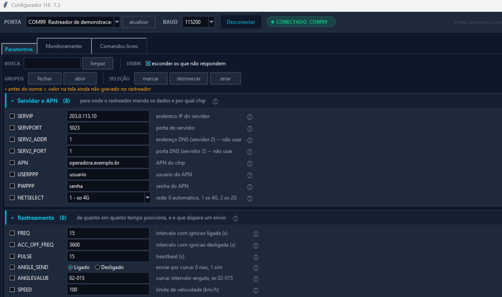
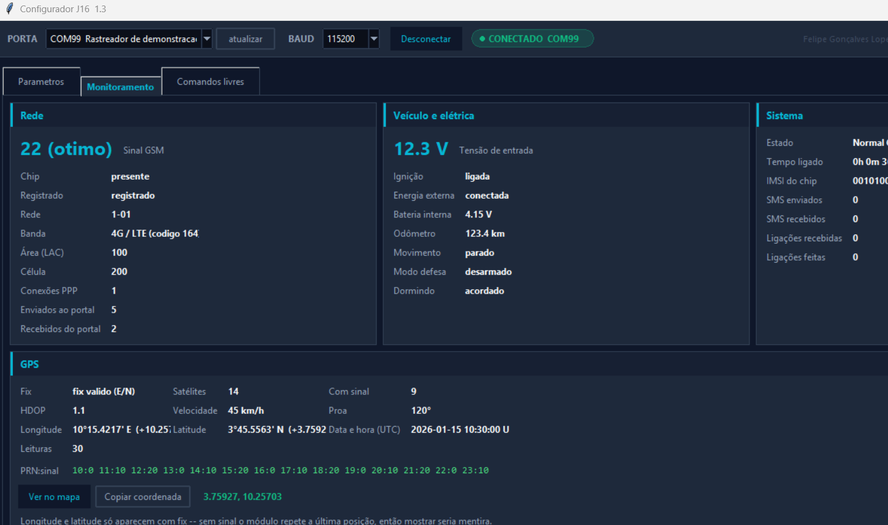

# Configurador J16

[](https://github.com/iambot1193/j16-protocolo/actions/workflows/ci.yml)
[](https://github.com/iambot1193/j16-protocolo/actions/workflows/codeql.yml)
[](LICENSE)

Configurador alternativo para o rastreador GPS J16, cobrindo um protocolo de
porta USB sem nenhuma documentação pública. Veio de uma necessidade concreta:
configurar e diagnosticar em campo sem depender só da ferramenta do
fabricante, que não expõe todos os parâmetros do firmware nem se presta a
automação.

**[DESAFIO.md](DESAFIO.md)** — o que quase deu errado reconstruindo esse
protocolo do zero: como validar hipóteses sem manual, como testar comandos
desconhecidos sem arriscar um aparelho real, um bug de coordenada por escala
errada, e comandos destrutivos escondidos ao lado de comandos inofensivos.

As telas abaixo são de uma sessão de demonstração com dados 100% fictícios
(nenhum aparelho real conectado) — mesma interface, dados de exemplo.



90 parâmetros mapeados, 58 confirmados respondendo neste firmware, agrupados
por assunto com busca, seleção em lote e indicação de valor não gravado.



Status do sistema, telemetria do veículo e posição GPS decodificados em
tempo real a partir do fluxo binário do aparelho — sinal, tensão, odômetro,
satélites e coordenada, tudo atualizado a cada ciclo de leitura.

## Funcionalidades

- **Tabela de parâmetros com ajuda contextual** — 90 parâmetros mapeados, 58
  confirmados respondendo neste firmware. Cada campo tem descrição, formato e
  exemplo; os que não respondem ficam sinalizados, não escondidos.
- **Console de comandos livres** — qualquer comando pode ser digitado, mesmo
  sem atalho na tela; o histórico anota o que foi enviado e o que voltou.
- **Aba de monitoramento ao vivo** — status do sistema e posição GPS
  decodificados em tempo real a partir do fluxo binário do aparelho.
- **Importar/exportar configuração** — grava e recupera a configuração
  completa de um aparelho em arquivo.
- **Comandos perigosos bloqueados por padrão** — corte de combustível,
  desligamento remoto e apagamento de servidor exigem confirmação explícita;
  nunca disparam por um clique sozinho.
- **Backup automático antes de cada gravação** — sem precisar lembrar de
  fazer, sempre existe caminho de volta.

## Como rodar

```
pip install -r requirements.txt
python j16gui.py
```

Sem aparelho conectado, `python j16gui.py --selftest` roda os testes
automatizados do parser de protocolo e da interface — **159 verificações**,
dados 100% fictícios, não depende de hardware. CodeQL roda no CI a cada push.

## O que tem aqui

| Arquivo | O quê |
|---|---|
| `j16proto.py` | protocolo de porta USB: montagem/decodificação de quadro, opcodes, testes |
| `j16gui.py` | interface (tkinter): tabela de parâmetros, console, monitor, backups |
| `ajuda.py` | textos de ajuda contextual por grupo e por campo |
| `tema.py` | tema visual da interface |

## Stack

Python 3, `tkinter` (interface) e `pyserial` (porta serial) — sem
dependência além disso.

## O que não está aqui

Este repositório é só o configurador. Ficam fora do controle de versão
público: capturas reais de tráfego do protocolo, configurações exportadas de
aparelhos reais, credenciais de rede/servidor de qualquer operação real, e o
material do fabricante (executável, manuais, drivers) — por não ser meu para
redistribuir.

## Licença

MIT.
